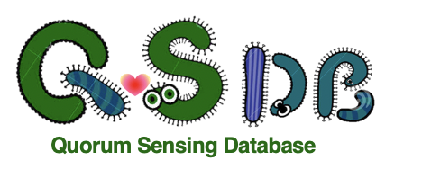

# 
 Quorum sensing gene database for archaea and bacteria, with a focus on microbes related to environmental engineering.

## Introduction

Quorun sensing is the communication in microbes. They use different signaling molecules to respond to the environment. The QS phenomenon has long been observed, especially in *Vibro chole*. QS was also found to be related in xxxx. In recent years,


## Methodology

The QSDB xxx.

## Structure
In the database

## Download

You can simply download the data file that you need from the directory. You can also clone the whole repository by
```
git clone https://github.com/Kevin-Moo/QSDB
```
This will download all the folders and files, including the scripts.
## Contact
Your comments and input are highly welcomed! For any technical issues or questions please contact laomunker@gmail.com.
