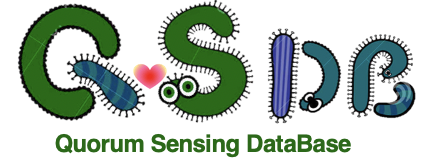

# 
 Quorum sensing gene database for archaea and bacteria, with a focus on microbes related to environmental engineering.

## Introduction

Quorum sensing (QS) is a cell-cell communication process used by microbes to control and coordinate the behavior of the population. QS has long been studied, and in recent years environmental engineers started to realize that QS could play an important role in environmental engineering. For example, QS is involved in biofilms formation, denitrification, sludge granularization, and membrane fouling.

Microbiology studies have accumulated great knowledge about how QS works at the molecular level. However, previous studies are mostly in model microorganisms, while the environmental microbiomes are highly complex. To better understand QS in environmental microbiomes we need a good QS gene reference database.

## Methodology

QSDB is an integration of curated literatures and current database. We collected reported QS genes that are relevant to environmental functions from literatures, and then integrated with the genes from KEGG Quorum Sensing pathway. The sequence of each genes, as well as their original species, were parsed and then redundancy is removed. The resultant database therefore can serve as useful reference for metagenomic studies.


## Download

You can simply download the data file that you need from the directory. You can also clone the whole repository by
```
git clone https://github.com/Kevin-Moo/QSDB
```
This will download all the folders and files, including the scripts.
## Contact
Your comments and input are highly welcomed! For any technical issues or questions please contact laomunker@gmail.com.
